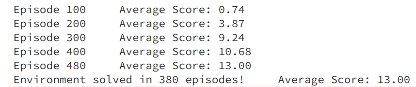
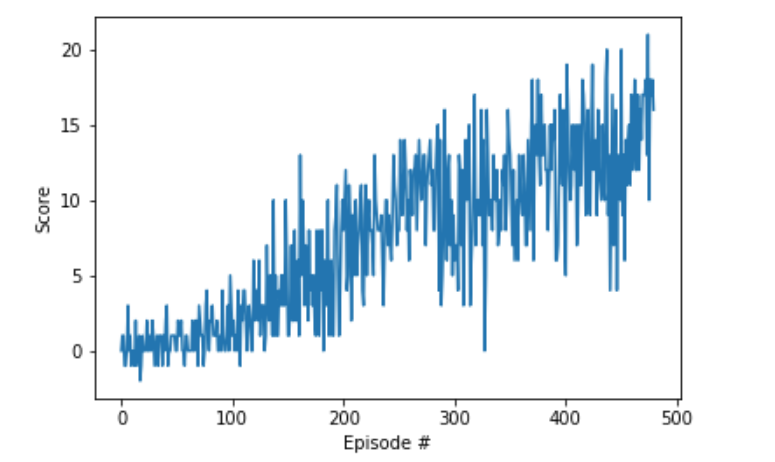

# Implementation description

## Learning algorithm

Vanilla DQN, Double DQN, Experience Replay are used for this project.

DQN model is built with Linear layers and leaky Relu activation functions. 4 Layers of size 512, 256, 128 performed well. Further to stabilize the learning dropout layers are added here with prob 0.5 while training.

### Hyperparameters

```python
BUFFER_SIZE = int(3*1e5)  # replay buffer size
BATCH_SIZE = 64         # minibatch size
GAMMA = 0.999            # discount factor
TAU = 1e-3              # for soft update of target parameters
LR = 2e-4               # learning rate 
UPDATE_EVERY = 4        # how often to update the network
```

## Plots for the rewards

The following plots summarises the learning process of the agent through different episodes. The agent took 380 episodes to solve the environment.



## Ideas for future work

Following optimizations can be applied to the project:

- Noisy Networks for Exploration
- A Distributional Perspective on Reinforcement Learning
- Rainbow: Combining Improvements in Deep Reinforcement Learning
- Distributional Reinforcement Learning with Quantile Regression
- Hierarchical Deep Reinforcement Learning
- Neural Episodic Control